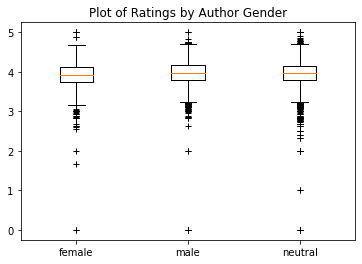
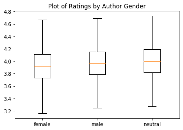

# Goodreads by Gender
<em>Do Goodreads Reviews Contain a Gender Bias?</em>

Last year I powered through a copy of Marie Kondo’s <em>The Life-Changing Magic of Tidying Up</em> and absolutely loved it. However, when I checked it out on Goodreads I was surprised to find that it only garnered an average rating of 3.84 (I gave it 5 stars). My inner cynic wondered if it was because the author is a woman.

Historically, women have taken on male pseudonyms to solicit male readership and avoid prejudice in male-dominated publishing circles. While the practice is less common today, I couldn’t help but wonder if women who publish under their given names still suffer due to implicit bias. In other words, do readers unconsciously judge women authors more harshly than men?

I pick on Goodreads because, paradoxically, I love using it. It’s a great social-network-slash-recommendation-system where I can both show off how well-read I am and find new books to read.

Goodreads provides an average rating for each book, which serves as a way to vet unknown books before investing time and money in them. Of course, like most rating systems, Goodreads suffers from a number of issues including reviewers not understanding the rating scale, basing their review off of irrelevant information, or simply having different tastes than my own. However, also like most rating systems, it can also have a lot of power, and it’s probably in an author’s interest to have a good rating, especially if they’re relatively unknown.

It turns out somebody already generously took the time to scrape a Goodreads dataset and upload it to Kaggle. It includes the author’s name (or authors’ names if there are multiple) and average rating for each book, which we need. The dataset looks incomplete — I searched for Marie Kondo’s name and didn’t find it. But it does contain more than 10,000 unique titles and is relatively recent (2019), so it’s a good start.

To determine the gender of authors, I used a baby names dataset compiled by the United States Social Security agency. It lists the name, gender, and count by year, from 1880 to 2018. Ideally I’d use a global baby names dataset, but I figured the United States, being a relatively diverse country, will have a wide representation of names and therefore be an acceptable proxy.

It turns out that determining the gender of a name can get pretty nuanced. (This makes sense, since gender is just a social construct, eh?)

For example, some names can be different genders depending on the language of origin. For example, Karen is typically female in English, but male in Armenian. There are also names which are gender-neutral in English, such as Taylor, Hunter, or...Kale (I guess). 

To resolve the gender-ambiguity of names, I used the crude heuristic where a name is the gender that it is assigned to at least 95% of the time. So, if there are 10,000 Karens and at least 9,500 of them are female, then Karen is female. On the other hand, if a name doesn’t have this 95/5 split, then I labelled it gender-neutral.

Also, as I mentioned previously, some authors still publish under pseudonyms. Then there’s no way to tell using just the dataset what the actual gender of the author is. Fortunately, this isn’t a problem - if we assume that people are giving ratings based on perceived gender of the author, then it doesn’t matter what the author’s true gender is. 

Finally, if an author’s name isn’t represented in the baby names list (ex. Kazuo Ishiguro), or if it only consists of  initials (ex. J.K. Rowling), then I labelled it gender-neutral (because I’m lazy).

Some more assumptions:
Some books have multiple authors, but only one rating. I added a unique data point for each author. So if a book has Author A (female) and Author B (male) and has a rating of 4.0, then I added the following two data points:

Female, 4.0
Male, 4.0

On a related note, some authors have multiple books. I added a unique data point for each book. So if Author A (female) wrote Book 1 with a rating of 4.5 and Book 2 with a rating of 3.0, I added the following data points:

Female, 4.5
Female, 3.0

There are a few books with an average rating of 0 in the dataset. I removed them because it’s impossible for users to give books a rating of 0, so this indicates that nobody has reviewed them yet.

After following the steps above to normalize the data, I produced the following boxplots for comparison:

Based on what I can remember from my high school statistics class, and some light Googling, there doesn’t appear to be much difference in ratings by author gender. If I remove the outliers, the ratings for female authors does look to be juuust slightly lower:

And indeed the median ratings value for female authors, 3.92, is lower than that for male and gender-neutral authors, at 3.97 and 4.0 respectively. But this doesn’t seem statistically significant.

I did, however, notice that the number of reviewed female authors is much less than the number of male authors (~4.5k vs ~10.7k). I assume this is because men have historically had more opportunities to write and publish, and that there are simply more male authors than women authors at the moment. I’d like to think that the gender ratio of recently-published authors is more equal.

Or is it? The plot thickens...

## Datasets
* https://www.kaggle.com/jealousleopard/goodreadsbooks
* https://www.ssa.gov/oact/babynames/limits.html
